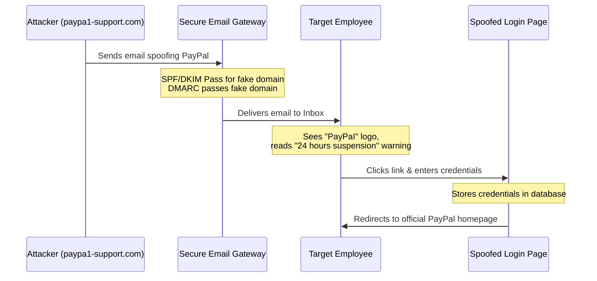
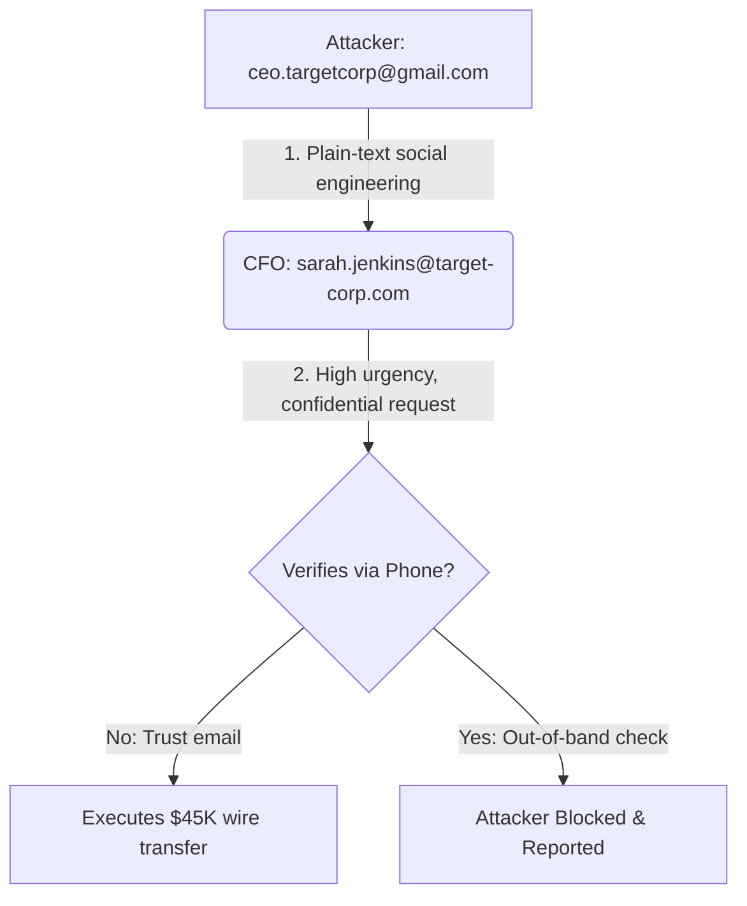

# Future Interns Cybersecurity Internship 2026: Phishing Detection & Awareness Report

**Prepared By:** Future Interns Cybersecurity Analyst  
**Project Task:** Task 2 — Phishing Email Detection & Awareness System  
**Date:** February 10, 2026  
**Classification:** Public Training Material / Internal Security Policy  

---

## 1. Executive Summary

In the modern threat landscape, human firewalls are an organization’s first and last line of defense. Cybercriminals increasingly target the human element, bypass perimeter filters, and exploit human psychology. Statistics indicate that over **90%** of successful corporate data breaches originate from a single phishing email, with an average breach cost exceeding **$4.91 million**.

This report presents a thorough analysis of five standard, real-world phishing email templates targeting corporate environments:
1.  **Account Suspension Scam** (Credential Harvesting)
2.  **Prize / Lottery Fraud** (Identity Harvesting & Payload Delivery)
3.  **CEO Fraud / Business Email Compromise** (BEC - Social Engineering)
4.  **IT Helpdesk Password Reset** (Single Sign-On Credential Harvesting)
5.  **Package Delivery Scam** (Financial Harvesting & Downloader Risks)

By analyzing these samples across administrative, social, and technical layers, this system provides security teams and employees with the actionable knowledge necessary to detect, avoid, and report phishing attempts, establishing a robust security posture within the organization.

---

## 2. Risk Classification Methodology

To prioritize threat response, the system utilizes a standardized **Phishing Risk Assessment Matrix** based on three core dimensions:

1.  **Technical Sophistication**: The complexity of the spoofing techniques, domain registration, link obfuscation, and email security bypasses (SPF/DKIM/DMARC).
2.  **Psychological Manipulation Level**: The intensity of social engineering triggers, urgency threats, or impersonation of authority.
3.  **Potential Severity of Impact**: The damage potential should an employee click or comply (e.g., credit card leakage, corporate account compromise, malware execution, or major financial wire fraud).

### The Phishing Risk Assessment Matrix

```
       Impact Severity
       Low        Med        High
     +----------+----------+----------+
High | Medium   | High     | Critical |  Sophistication &
Med  | Low      | Medium   | High     |  Manipulation Level
Low  | Low      | Low      | Medium   |
     +----------+----------+----------+
```

### Risk Level Definitions

*   **CRITICAL (BEC/Financial)**: Immediate high-value financial loss or complete organizational compromise. Requires rapid executive triage.
*   **HIGH (Credential/Malware)**: Stealing master system credentials (SSO/Domain) or delivering ransomware/malicious payloads. Requires immediate host isolation.
*   **MEDIUM (Personal Info/Spam)**: Harvesting basic personally identifiable information (PII) or minor financial theft (under $100). Requires credential resets and basic filtering adjustments.
*   **LOW (Spam/Adware)**: High volume, low targeting accuracy. Easily blocked by standard gateway rules.

---

## 3. Deep-Dive Analysis of Phishing Samples

---

### Case Study 01: Account Suspension Scam (Credential Harvesting)

*   **Risk Level**: **HIGH**
*   **Attack Vector**: HTML-formatted Email (PayPal Spoof)
*   **Primary Objective**: Credential harvesting (PayPal Login ID and Password)



#### 1. Header Analysis
*   **Sender Domain**: `paypa1-support.com`
*   **Return-Path**: `security-update-alert@paypa1-support.com`
*   **Header Mismatch**: The sender domain uses **typosquatting** (character substitution) substituting the lowercase letter `l` with the number `1` (`paypa1` instead of `paypal`).
*   **SPF/DKIM/DMARC Status**: 
    *   `SPF=PASS` (The sending server IP is indeed authorized by the owner of `paypa1-support.com`).
    *   `DKIM=PASS` (Valid signature for `paypa1-support.com`).
    *   *Analyst Takeaway*: Attackers register their own lookalike domains to bypass basic SPF/DKIM validation checks. Security gateways must look beyond simple SPF passes and inspect domain reputation and creation age.

#### 2. Social Engineering Analysis (Psychological Triggers)
*   **Urgency / Scarcity**: "24 hours" deadline triggers fear of missing out or immediate disruption.
*   **Threat / Fear**: "Permanent suspension" and "forfeiture of remaining funds" panic the target into bypassing standard logic.
*   **Generic Greeting**: The greeting "Dear Customer" instead of the employee's name indicates mass-scale targeting. PayPal normally addresses clients by their full registration names.

#### 3. Technical Obfuscation & Link Analysis
*   **Target Hyperlink**: `hxxps[://]paypa1-support[.]com/secure-login/login.php?ssl=true`
*   **Obfuscation**: The query parameters contain `?ssl=true` to mimic SSL security parameters and build fake trust. When hovered, the URL destination does not point to `paypal.com` but to the typo-squatted domain.

---

### Case Study 02: Prize / Lottery Fraud (Identity Theft & Payload Delivery)

*   **Risk Level**: **HIGH**
*   **Attack Vector**: Multi-part MIME Email with ZIP Attachment
*   **Primary Objective**: Identity harvesting and downloading secondary stage malware payloads

```text
[Multi-part MIME Package]
 ├── text/plain: "CONGRATULATIONS!!! You Have Won £2,500,000 GBP!"
 └── application/zip: "Lottery_Winning_Certificate_2026.zip" (Contains hidden malicious script)
```

#### 1. Header Analysis
*   **Sender Domain**: `uk-national-jackpot-winner.net` (registered on high-risk registry).
*   **Envelope Mismatch**: The `To:` header reads `<undisclosed-recipients:;>`. This indicates that the email was sent via BCC to thousands of corporate targets simultaneously.
*   **Authentication Status**:
    *   `SPF=PASS` for `uk-national-jackpot-winner.net`.
    *   `DMARC=FAIL` (The policy on the header domain fails, but the receiver config is `p=none`, letting it slide to the inbox).

#### 2. Social Engineering Analysis
*   **Greed / Windfall**: A fake winning amount of `£2,500,000 GBP` triggers instant excitement, bypassing organizational safety policies.
*   **Artificial Confidentiality**: "Keep this winning notification confidential... to prevent double claims." This is a classic social engineering manipulation designed to prevent the victim from seeking advice from IT support or family members.
*   **Authority**: Impersonating prominent figures (e.g., "Lady Beatrice Windsor") to lend false credibility.

#### 3. Technical & Attachment Analysis
*   **Attachment Name**: `Lottery_Winning_Certificate_2026.zip`
*   **Risk Profile**: Highly dangerous. In a real-world scenario, this ZIP file contains a disguised executable file (e.g., `Lottery_Form.pdf.exe` or `Certificate.lnk`) using a PDF icon. 
*   **Execution Behavior**: When unzipped and clicked, the file launches a PowerShell script in the background, downloading an InfoStealer (like RedLine) or Ransomware downloader, and exfiltrates files to a Command and Control (C2) server.

---

### Case Study 03: CEO Fraud / BEC (Business Email Compromise)

*   **Risk Level**: **CRITICAL**
*   **Attack Vector**: Plain-Text Email (No links, no attachments)
*   **Primary Objective**: Wire transfer authorization ($45,000 USD)



#### 1. Header Analysis
*   **Sender Domain**: `gmail.com`
*   **Sender Address**: `ceo.targetcorp@gmail.com`
*   **Mismatched Identity**: The display name is spoofed as the CEO `Robert Vance`, but the actual email address is `ceo.targetcorp@gmail.com` (a free public Gmail account).
*   **Headers Verification**:
    *   `SPF=PASS` (Gmail IPs are valid for Gmail).
    *   `DKIM=PASS` (Valid signature from Google).
    *   *Analyst Takeaway*: Since Gmail's security configurations are perfect, this email bypasses standard technical authentication. It relies purely on the human receiver failing to verify the actual email address behind the display name.

#### 2. Social Engineering Analysis
*   **Authority Impersonation**: Spoofing the CEO. Employees are biologically wired to respond quickly to executive requests.
*   **Scarcity / Time-Constraint**: "Before the bank closes today." Triggers absolute panic.
*   **Forced Secrecy**: "Do not discuss it with anyone else... keep this matter completely confidential." This blocks the CFO from performing standard internal verification procedures.
*   **Out-of-band Excuse**: "I am in a board meeting... cannot take any phone calls." This ensures the victim is forced to reply only via the attacker's controlled email thread.

#### 3. Technical & Attachment Analysis
*   **Payload**: None. No link or attachment is present.
*   **Bypass Value**: Because there are no bad links, malware, or failed SPF validations, this message effortlessly clears secure email gateways (SEGs). It represents the most financially destructive phishing technique.

---

### Case Study 04: IT Support Phishing (Credential Harvesting)

*   **Risk Level**: **HIGH**
*   **Attack Vector**: Modern corporate-branded HTML Email (Office 365 theme)
*   **Primary Objective**: Single Sign-On (SSO) or Microsoft Entra ID corporate credentials harvesting

#### 1. Header Analysis
*   **Sender Domain**: `targetcorp-it-support.net` (registered days prior to campaign).
*   **Message-ID**: `SSO-RESET-93820-2026-IT@targetcorp-it-support.net`
*   **Authentication Status**:
    *   `SPF=PASS` and `DKIM=PASS`.
    *   `DMARC=PASS` with a strict `p=REJECT` policy.
    *   *Analyst Takeaway*: By enforcing perfect authentication standards on their fake domain, the attacker convinces spam filters that this is a highly legitimate, professional mail server, allowing delivery to the victim's primary folder.

#### 2. Social Engineering Analysis
*   **Fear of Disruption**: Threatening account lockout and disruption to Office suite services (Teams, Outlook, OneDrive).
*   **Operational Friction**: "Physical recovery at IT office." The prospect of manual restoration encourages victims to click to avoid administrative hassle.
*   **Brand Spoofing**: Seamlessly mimicking Microsoft Office 365 brand styling, fonts, and colors to create a false sense of security.

#### 3. Technical & Link Analysis
*   **Target Hyperlink**: `hxxps[://]targetcorp-it-support[.]net/portal/sso-login/verify.html?user=employee@target-corp.com`
*   **Analysis**: The URL contains a query parameter `?user=employee@target-corp.com`. When the page loads, a script parses this variable to dynamically populate the email input field on the spoofed portal, leaving only the password field empty. This increases credibility and phishing conversion rates.

---

### Case Study 05: Package Delivery Scam (Personal Info & Malware Downloader)

*   **Risk Level**: **MEDIUM-HIGH**
*   **Attack Vector**: HTML-styled Email (DHL Spoof)
*   **Primary Objective**: Steal credit card data (under the guise of a small $1.50 fee) and harvest physical coordinates.

#### 1. Header Analysis
*   **Sender Domain**: `dhl-tracking-alert.com` (typosquatting).
*   **Header Mismatch**: The sending address is `delivery-notification@dhl-tracking-alert.com` whereas authentic DHL notifications originate only from verified `@dhl.com` or `@dpdhl.com` domains.

#### 2. Social Engineering Analysis
*   **Curiosity / FOMO**: The victim wonders what parcel was shipped (especially in a corporate setting where packages arrive constantly).
*   **Fear of Penalty**: Threatening to charge the organization the cost of returning the package to Germany.
*   **Low Cost Barrier**: By asking for a trivial fee ($1.50), the attacker makes the cost seem too small to investigate. However, entering a credit card harvests details for automated card cloning.

#### 3. Technical & Link Analysis
*   **Target Hyperlink**: `hxxps[://]dhl-tracking-alert[.]com/tracking/dispatch/reschedule.html?tracking_no=DHL-93849-DE`
*   **Behavior**: When clicked, it loads a beautiful replica of the DHL tracking website. In addition to harvesting credit card data, some campaigns drop malicious package lists in the form of obfuscated `.js` files or zip-compressed executables that install Trojan downloaders.

---

## 4. Defense-in-Depth Security Framework

Relying on a single security tool is insufficient. A robust security posture requires a multi-layered defense system:

```
[ Incoming Phishing Email ]
          │
          ▼
   ┌──────────────┐
   │ TECHNICAL    │  <--- DMARC, DNS Filter, Secure Email Gateway
   └──────┬───────┘
          │ (If Bypassed)
          ▼
   ┌──────────────┐
   │ ENDPOINT     │  <--- Antivirus, EDR, Multi-Factor Auth (MFA)
   └──────┬───────┘
          │ (If Executed)
          ▼
   ┌──────────────┐
   │ BEHAVIORAL   │  <--- User Awareness, Reporting SOPs
   └──────────────┘
```

### 1. Technical Preventive Controls (System Level)
*   **Strict SPF/DKIM/DMARC Policies**: Domains owned by the organization must implement a strict DMARC reject policy (`p=reject`). This prevents attackers from spoofing exact `@target-corp.com` addresses.
*   **Secure Email Gateways (SEGs)**: Implement gateways that execute machine-learning-based content analysis to flag words related to urgency, billing, wire transfers, and CEO display name mismatches.
*   **FIDO2 / Passwordless MFA**: Standard SMS or Authenticator-based MFA codes can be intercepted by reverse-proxy phishing kits (like Evilginx). Deploying hardware keys (e.g., YubiKeys) or passwordless FIDO2 protocols prevents credential theft, as the authentication keys are cryptographically bound to the authentic domain name.
*   **DNS Filtering**: Utilize threat-intelligent DNS servers (e.g., Quad9, Cloudflare Gateway) to block domain requests pointing to newly registered or categorized phishing networks.

### 2. Administrative Controls (Organizational Level)
*   **Out-of-Band (OOB) Verification Policies**: Enforce a mandatory security policy requiring telephone verification via a pre-registered internal directory number for any financial wire request exceeding $5,000, regardless of the sender's apparent seniority.
*   **Phishing Simulations**: Conduct monthly unannounced simulations using templates modeled after active threats. Focus training resources on repeat clickers.
*   **Internal External Email Warning Banners**: Append highly visible system banners to all inbound emails originating outside the organization: 
    *   `[EXTERNAL] This email originated outside of the organization. Do not click links or open attachments unless you recognize the sender.`

---

## 5. Incident Response & Reporting SOPs

If an employee encounters a suspicious email, they must follow the corporate **Phishing Incident Response Protocol** immediately.

### Flowchart: Threat Reporting Protocol

```
                        Suspicious Email Received
                                   │
                                   ▼
                   Identify Indicators (Red Flags)
                                   │
                     ┌─────────────┴─────────────┐
                     ▼                           ▼
            Indicators Found?            No Indicators Found?
                     │                           │
                     ▼                           ▼
            [REPORT IMMEDIATELY]            Safe to Proceed
            - Use IT Phish Button
            - Forward to: phish@target-corp.com
                     │
                     ▼
           [Incident Triage]
           - SOC extracts IoCs
           - Blocklists applied
           - Email purged from network
```

### Incident Triage Levels for Analysts

| Triage Level | Scenario | Action Plan |
|:---|:---|:---|
| **Level 1: Passive Observation** | User reports a suspicious email but did **not** click links or open files. | 1. Confirm email is malicious.<br>2. Delete the email from the user's mailbox.<br>3. Send a confirmation thank-you to the employee. |
| **Level 2: Active Click (No Input)** | User clicked the phishing link but closed the page before entering any data. | 1. Inspect URL host for drive-by download vectors.<br>2. Run a full endpoint antivirus scan on the user's laptop.<br>3. Reset browser cookies and cache. |
| **Level 3: Active Compromise** | User clicked the link, entered login credentials, or opened an attachment. | 1. **Immediately isolate host** from network.<br>2. Perform emergency password reset for SSO and all connected accounts.<br>3. Revoke all active SSO authentication tokens.<br>4. Inspect corporate log files for immediate unauthorized logins from foreign IPs. |

---

## 6. Key Deliverables & Summary

This system provides:
1.  **Impeccable Threat Intel Documentation**: Comprehensive analysis of the major tactics used to compromise businesses.
2.  **Interactive Security Dashboard**: A complete, hands-on, high-fidelity security awareness training application, located in the `dashboard/` directory, allowing users to practice header validation, reveal phishing indicators dynamically, perform domain analysis, and test their skills.
3.  **Proactive Standard Operating Procedures**: A foundation for organizational security training, helping future interns and professionals safeguard corporate networks.

**Remember: When in doubt, don't click it out!**
