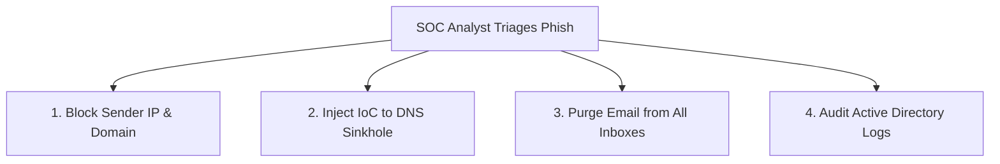

# Corporate Standard Operating Procedures (SOP): Phishing Incident Reporting & Triage

**Document Reference**: SOP-SEC-2026-02  
**Effective Date**: February 10, 2026  
**Applicability**: All Corporate Employees & Security Operations Center (SOC) Staff  

---

## 1. Purpose & Scope

This Standard Operating Procedure (SOP) defines the protocol for identifying, reporting, and triaging suspicious emails. Its goal is to minimize organizational exposure to Business Email Compromise (BEC), credential harvesting, and malware delivery by providing clear workflows for employees and immediate mitigation guidelines for the security team.

---

## 2. Employee Reporting Procedure (All Users)

When an employee identifies any phishing red flags (e.g., mismatched sender domain, intense urgency, requests for confidential wire transfers, or unexpected attachments), they must execute the following protocol:

### Step 2.1: The "DO NOTs" (Prevent Escalation)
*   **DO NOT** click any links or buttons inside the email.
*   **DO NOT** open, preview, or download any attachments.
*   **DO NOT** reply to the email or contact the sender.
*   **DO NOT** forward the email directly to colleagues (this propagates the threat across the network).

### Step 2.2: Reporting Options
*   **Option A: The IT Phish Button (Preferred)**: Click the "Report Phishing" button integrated into the Outlook/Microsoft 365 menu bar. This automatically forwards the email with full SMTP headers to the security team and purges the message from the user's inbox.
*   **Option B: Manual Forwarding**: Create a fresh email to **phish@target-corp.com**. Drag the suspicious email from the inbox list and drop it into the message body as an **attachment** (this preserves critical SMTP header routing paths for the SOC analysts).

---

## 3. SOC Incident Triage Workflow (Security Analysts)

Upon receiving a phishing report at `phish@target-corp.com`, a SOC analyst must triage the threat within **15 minutes** using the following step-by-step containment protocol:

### Step 3.1: Analysis & Header Verification
1.  Open the email inside an **isolated sandbox virtual machine**.
2.  Extract raw headers and verify sender authentication:
    *   Inspect `Return-Path` vs `From` mismatch.
    *   Verify `Authentication-Results` for SPF, DKIM, and DMARC status.
    *   Extract the originating sender IP (from the lowest `Received` hop).
3.  Query the originating IP and domain reputation via **VirusTotal** or **AbuseIPDB**.

### Step 3.2: Containment & Threat Mitigation
If the email is triaged as **Malicious**, execute these containment steps immediately:



1.  **Block sender domain**: Inject the sender domain (e.g., `paypa1-support.com`) into the Secure Email Gateway (SEG) domain blocklist.
2.  **Null-route sender IP**: Block the originating IP address at the perimeter firewall.
3.  **DNS Sinkhole**: Add the phishing landing page domain to the corporate DNS filter blacklists to block internal connections.
4.  **Network-wide Purge**: Execute a tenant-wide search-and-purge command (e.g., Exchange Online PowerShell `Search-Mailbox`) to remove matching emails from all user mailboxes before other employees click them.

---

## 4. Post-Compromise Containment SOP (User Clicked)

If an employee reports that they **clicked a link, entered passwords, or opened an attachment**, the security team must initiate an **Emergency Host Isolation** sequence:

### Level 1: Credential Exposure Triage
1.  **Revoke Active Tokens**: Immediately invalidate all active Office 365 / SSO login sessions for the compromised user account via the Entra ID / Active Directory console.
2.  **Reset Password**: Enforce a mandatory password change requiring complex character sequences.
3.  **Verify MFA Registrations**: Inspect the user's registered MFA devices to ensure the attacker has not registered a secondary authenticator device.

### Level 2: Attachment Execution Triage
1.  **Isolate Device**: Disconnect the compromised workstation from the corporate network (disable WiFi and unplug Ethernet).
2.  **EDR Triage**: Initiate a full malware scan using the endpoint EDR agent (e.g., CrowdStrike, SentinelOne).
3.  **Audit Logs**: Check local system logs and DNS logs for active Command and Control (C2) communication attempts.

---

## 5. Communications Templates

### Template A: Standard Thank-You response to Reporting Employee
*To be sent by the SOC team once a reported email has been triaged as phishing:*

```text
Subject: [SEC-TRIAGE] Suspicious Email Safely Resolved - Thank You!

Dear [Employee Name],

Thank you for reporting the suspicious email with the subject: "[Email Subject]". 

Our security operations center has successfully triaged the message and confirmed it was a phishing attempt. We have initiated corporate containment procedures, blocked the sender domain, and purged the email from our network.

Because of your quick reporting, you helped protect our organization from potential exposure. Since you reported the email without clicking or opening the attachment, no further action is required on your workstation.

Keep up the excellent work in keeping Target Corp safe!

Regards,
Target Corp Security Operations Team
phish@target-corp.com
```

### Template B: Mandatory Security Warning to Compromised User
*To be sent after credentials have been reset due to an active compromise click:*

```text
Subject: [IMMEDIATE ACTION REQUIRED] Security Incident Containment - Account Reset

Dear [Employee Name],

This is an automated notification from the Target Corp Security Operations Center. 

We received a report regarding a malicious phishing email (" [Email Subject] ") that bypassed initial filters. Our records indicate that you may have interacted with this email or entered authentication details on the linked landing page.

To secure your corporate profile and prevent unauthorized lateral movement inside our networks, we have executed the following security actions:
1. Revoked all active network SSO session tokens.
2. Temporarily locked your account credentials.
3. Flagged your corporate workstation for EDR scanning.

WHAT YOU MUST DO NOW:
Please call the IT Service Desk immediately at +1 (555) 019-9000 to complete a verbal identity check. Once verified, IT support will guide you through resetting your password and establishing your new secure FIDO2 MFA keys.

Do not attempt to log back in until you have spoken directly with an IT security representative.

Sincerely,
Target Corp Security Operations Center
Incident Reference: #INC-2026-93821
```
